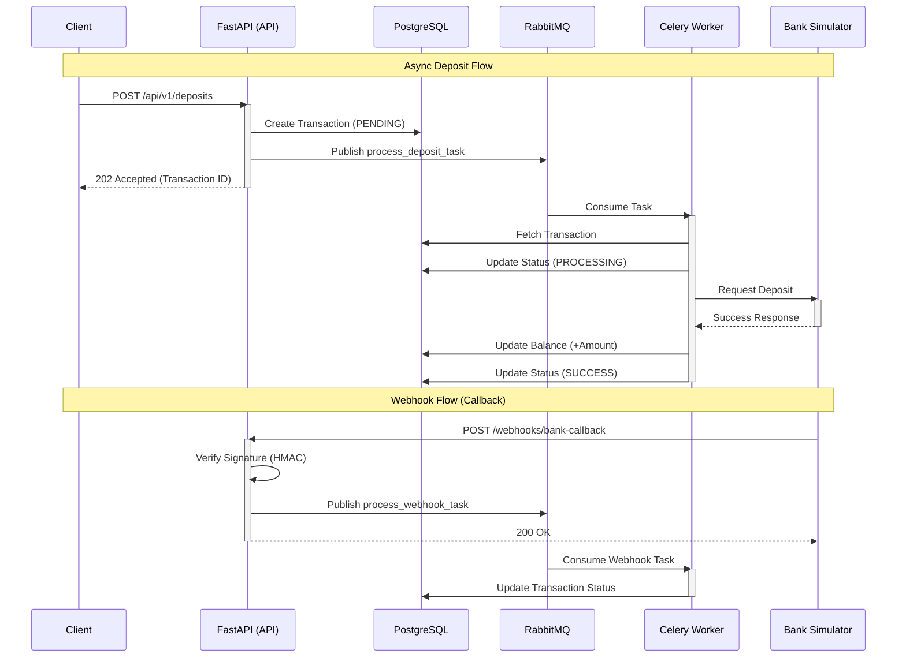

# System Architecture

This diagram illustrates the asynchronous payment processing flow of the Payment Gateway System.

## Component Roles
- **FastAPI**: Handles HTTP requests, validation, and queues tasks.
- **PostgreSQL**: Stores persistent data (Users, Transactions).
- **RabbitMQ**: Message broker for asynchronous task distribution.
- **Celery Worker**: Executes background tasks (Bank simulation, DB updates).
- **Redis**: Caches idempotency keys and stores Celery results.
